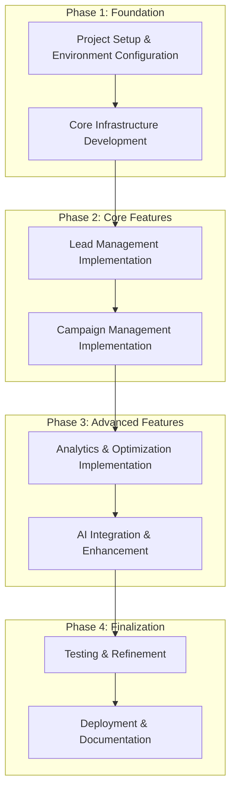
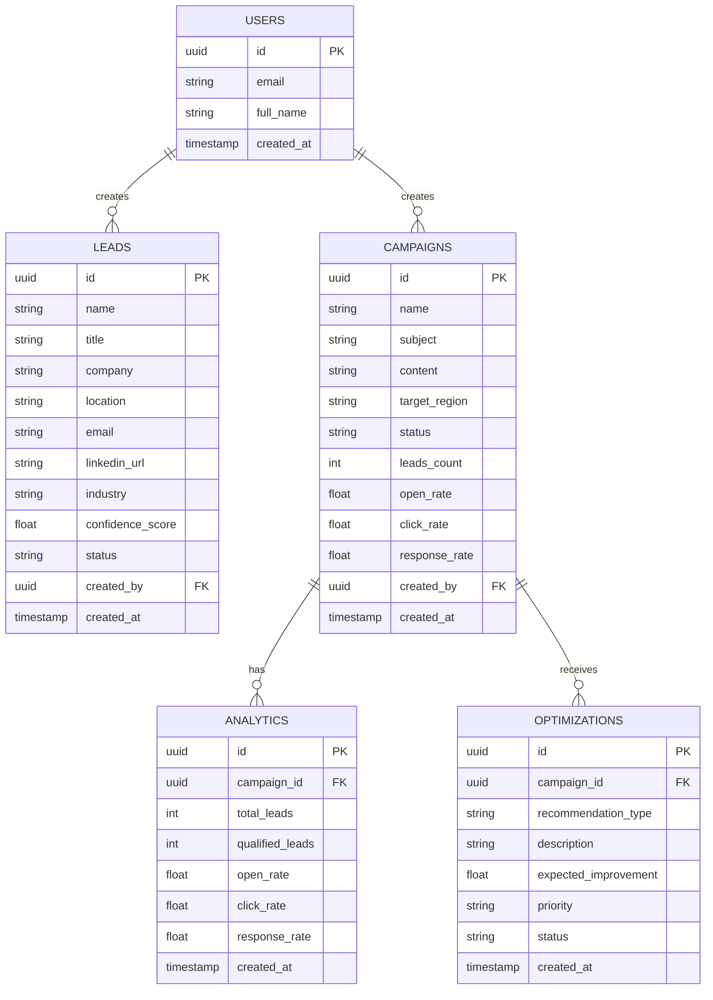
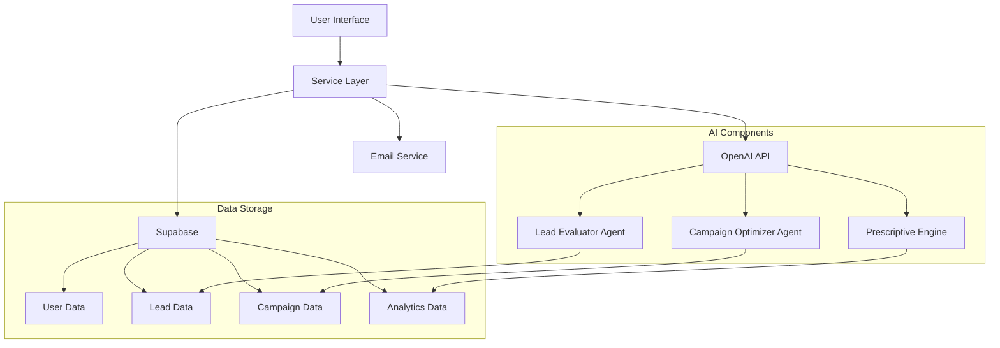

# Quotable App Development Roadmap

## Overview

This roadmap outlines the development plan for Quotable, an AI-powered application designed to revolutionize international lead generation and marketing campaign optimization. The roadmap is structured to balance UI completion with AI feature implementation, ensuring a focused and efficient development process.



## Phase 1: Foundation (Week 1)

### Project Setup & Environment Configuration

1. **Environment Variables & Security Setup**
   - Create `.env` file for local development
   - Setup `.env.example` as a template
   - Configure `.gitignore` to exclude sensitive files
   - Implement environment variable validation

2. **Supabase Configuration**
   - Setup Supabase project
   - Configure authentication
   - Create database tables for leads, campaigns, analytics
   - Setup row-level security policies

3. **API Integration Setup**
   - Configure OpenAI API integration
   - Setup email service integration (Gmail SMTP)
   - Implement secure API key storage

### Core Infrastructure Development

1. **Data Models & Type Definitions**
   - Enhance existing type definitions
   - Create database schema
   - Implement data validation

2. **Service Layer Implementation**
   - Create API service for Supabase interactions
   - Implement OpenAI service
   - Create email service

3. **UI Component Enhancement**
   - Refine existing UI components
   - Implement loading states
   - Create error handling components

## Phase 2: Core Features (Week 2)

### Lead Management Implementation

1. **Lead Scraping UI Enhancement**
   - Complete lead scraping interface
   - Implement source selection (Google Maps, LinkedIn)
   - Add progress indicators and status updates

2. **Basic Lead Scraping Functionality**
   - Implement simplified scraping using Puppeteer
   - Create data extraction logic
   - Implement storage in Supabase

3. **Lead Evaluation with RAG**
   - Implement basic RAG system for lead evaluation
   - Create confidence scoring algorithm
   - Develop industry and role classification

### Campaign Management Implementation

1. **Campaign Creator Enhancement**
   - Complete campaign creation interface
   - Implement template selection
   - Add targeting options

2. **Email Generation with AI**
   - Implement OpenAI integration for email generation
   - Create system prompts for different campaign types
   - Develop cultural adaptation features

3. **Campaign Execution**
   - Implement email sending functionality
   - Create scheduling system
   - Develop tracking mechanisms (opens, clicks, responses)

## Phase 3: Advanced Features (Week 3)

### Analytics & Optimization Implementation

1. **Performance Dashboard Enhancement**
   - Complete analytics dashboard
   - Implement data visualization components
   - Create filtering and comparison tools

2. **Root Cause Analysis**
   - Implement diagnostic algorithms
   - Create visualization for failure points
   - Develop recommendation system

3. **Predictive Benchmarking**
   - Implement prediction models
   - Create benchmark visualization
   - Develop trend analysis

### AI Integration & Enhancement

1. **Prescriptive Optimization Engine**
   - Implement AI-driven optimization suggestions
   - Create feedback loop for continuous improvement
   - Develop A/B testing framework

2. **Cross-Cultural Intelligence**
   - Enhance cultural adaptation features
   - Implement region-specific templates
   - Develop tone and style recommendations

3. **Advanced RAG Implementation**
   - Enhance lead qualification with more sophisticated RAG
   - Implement document processing for lead sources
   - Develop confidence scoring improvements

## Phase 4: Finalization (Week 4)

### Testing & Refinement

1. **User Testing**
   - Conduct usability testing
   - Gather feedback
   - Implement improvements

2. **Performance Optimization**
   - Optimize database queries
   - Improve UI performance
   - Enhance AI response times

3. **Bug Fixing**
   - Address identified issues
   - Conduct regression testing
   - Ensure cross-browser compatibility

### Deployment & Documentation

1. **Deployment Preparation**
   - Prepare production environment
   - Configure CI/CD pipeline
   - Setup monitoring

2. **Documentation**
   - Create user documentation
   - Develop technical documentation
   - Prepare API documentation

3. **Final Review & Launch**
   - Conduct final review
   - Prepare launch materials
   - Deploy to production

## Technical Implementation Details

### Database Schema



### AI Integration Architecture



### Security Implementation

To safely store secret keys when pushing to GitHub, we'll implement the following:

1. **Environment Variables**
   - Create a `.env` file for local development that contains all sensitive information
   - Add `.env` to `.gitignore` to prevent it from being committed
   - Create a `.env.example` file with placeholder values as a template

2. **Environment Variable Structure**
   ```
   # .env (DO NOT COMMIT)
   VITE_SUPABASE_URL=your_supabase_url
   VITE_SUPABASE_ANON_KEY=your_supabase_anon_key
   VITE_OPENAI_API_KEY=your_openai_api_key
   VITE_EMAIL_SERVICE_USER=your_email_service_user
   VITE_EMAIL_SERVICE_PASS=your_email_service_password
   ```

3. **Environment Variable Validation**
   - Implement validation to ensure all required environment variables are present
   - Add clear error messages when variables are missing

4. **Secure Access in Code**
   - Access environment variables through a centralized config file
   - Implement proper error handling for missing variables

5. **Example Implementation**
   ```typescript
   // src/lib/config.ts
   
   interface Config {
     supabase: {
       url: string;
       anonKey: string;
     };
     openai: {
       apiKey: string;
     };
     email: {
       user: string;
       pass: string;
     };
   }
   
   const validateEnvVar = (name: string): string => {
     const value = import.meta.env[name];
     if (!value) {
       throw new Error(`Missing environment variable: ${name}`);
     }
     return value;
   };
   
   export const config: Config = {
     supabase: {
       url: validateEnvVar('VITE_SUPABASE_URL'),
       anonKey: validateEnvVar('VITE_SUPABASE_ANON_KEY'),
     },
     openai: {
       apiKey: validateEnvVar('VITE_OPENAI_API_KEY'),
     },
     email: {
       user: validateEnvVar('VITE_EMAIL_SERVICE_USER'),
       pass: validateEnvVar('VITE_EMAIL_SERVICE_PASS'),
     },
   };
   ```

## Feature Implementation Priority

To ensure a balanced approach between UI completion and AI feature implementation, we'll prioritize features as follows:

### High Priority (Implement First)
1. Lead scraping UI and basic functionality
2. Campaign creation and management
3. Basic email generation with OpenAI
4. Performance dashboard with mock data
5. Supabase integration for data storage

### Medium Priority
1. Lead evaluation with RAG
2. Email sending functionality
3. Campaign performance tracking
4. Cultural adaptation features
5. Root cause analysis

### Lower Priority (Implement Last)
1. Advanced RAG implementation
2. Predictive benchmarking
3. A/B testing framework
4. Advanced optimization suggestions
5. Comprehensive analytics

## Development Guidelines

To avoid hallucinations and maintain focus during development:

1. **Follow the Feature Roadmap**
   - Stick to the prioritized feature list
   - Complete one feature before moving to the next
   - Regularly check progress against the roadmap

2. **Use Mock Data Strategically**
   - Create realistic mock data for development
   - Ensure mock data covers edge cases
   - Gradually replace mock data with real data

3. **Implement Incremental AI Features**
   - Start with basic AI implementations
   - Test thoroughly before enhancing
   - Document AI behavior and limitations

4. **Maintain Clear Boundaries**
   - Separate UI, business logic, and data access
   - Use typed interfaces between components
   - Document component responsibilities

5. **Regular Testing**
   - Test each feature as it's implemented
   - Conduct integration testing regularly
   - Validate AI outputs against expectations

## Conclusion

This roadmap provides a structured approach to developing the Quotable app, balancing UI completion with AI feature implementation. By following this plan, the development process will remain focused and efficient, avoiding hallucinations and deviations from the core requirements.

The roadmap is designed to be flexible, allowing for adjustments as development progresses and new insights emerge. Regular reviews of progress against the roadmap will help ensure the project stays on track and delivers a high-quality product that meets the requirements outlined in the PRD.